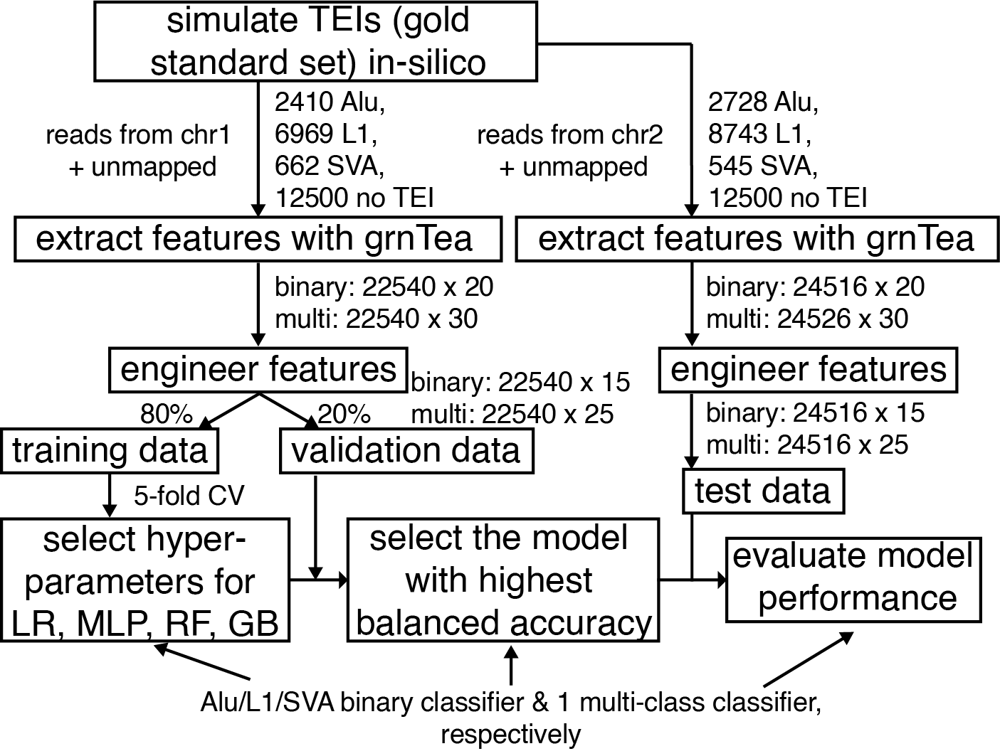

## This is a pre-release version of grnTea. This software is provided ``as is`` without warranty of any kind. We will formally relese grnTea very soon. Before that, please contact us if you have any questions or want to collaborate.


## grnTea

grnTea, pronounced as greenTea (comprehensive Transposable element analyzer with GRadieNt boosted tree), is designed to identify TE insertions from paired-end Illumina reads for WGS. Currently, we only have trained models for use in ancient human data. We will train models for modern human data. 




## Download

1. short reads (Illumina and Linked-Reads)

	+ 1.1 Latest version (master branch)

	```
	git clone https://github.com/ElainW/grnTea.git
	```

2. pre-processed repeat library used by grnTea (The same library is used for both short and long reads)  
	The file size is large, and please use git lfs (https://git-lfs.github.com/)  
	```
	git lfs get 
	```
	
	Or directly download through `wget https://github.com/parklab/xTea/raw/master/rep_lib_annotation.tar.gz`. 

4. Gene annotation file are downloaded from GENCODE, and decompressed gff3 file is required.
	+ For GRCh38 (or hg38), the gff3 file is downloaded and decompressed from https://www.gencodegenes.org/human/release_33.html ;
	+ For GRCh37 (or hg19), the gff3 file is downloaded and decompressed from https://www.gencodegenes.org/human/release_33lift37.html ;
	+ Or use the latest version

## Dependency

1. bwa (version **0.7.17** or later, require the **-o** option), which can be downloaded from https://github.com/lh3/bwa.
2. samtools (v1.0 or later), which can be downloaded from https://github.com/samtools.
3. Python 3.6+
	+ Here only show how to install through conda. User could also install in other ways, like pip. 
	+ pysam (https://github.com/pysam-developers/pysam, v0.12 or later) is required to be installed.
		+ Install pysam:
			```
			conda config --add channels r
			conda config --add channels bioconda
			conda install pysam -y
			```
	+ sortedcontainers
		+ Install sortedcontainers
		`conda install sortedcontainers -y`

	+ numpy (1.21.4), scikit-learn (0.24.2), and pandas (1.0.4)  
		+ Install numpy, scikit-learn and pandas
		`conda install numpy scikit-learn pandas -y`

4. bedtools (v2.27.1+), for training new models only
5. Note: bwa and samtools need to be added to the $PATH.


## Install


+ **Install free**
	
	If the dependencies have been install already, then install-free mode is recommended. User could directly run from the python scripts.


## Run xTea
1. **Input**
	+ A sample id file, e.g. a file named `sample_id.txt` with content (each line is one unique sample id):
	
		```
		NA12878
		NA12877
		```
	
	+ A file of listed alignments:

		+ An Illumina bam/cram file (sorted and indexed) list, e.g. a file named `illumina_bam_list.txt` with content (two columns separated by space or tab: sample-id bam-path):

			```
			NA12878 /path/na12878_illumina_1_sorted.bam
			NA12877 /path/na12877_illumina_1_sorted.bam
			```

2. **Run the pipeline from local cluster or machine**
	

	2.1 Generate the running script (if it is install-free, then use the full path of the downloaded `bin/xtea` instead.)
			
	+ Run on a cluster or a single node (by default `xtea` assume the reference genome is **GRCh38** or **hg38**, for `hg19` or `GRCh37`, please use `xtea_hg19`)
		+ Here, take slurm system as an example, if LSF then replace `--slurm` with `--lsf`. Other than slurm or LSF, users need to adjust the shell script header accordingly. Users also need to adjust the number of cores (`-n`) and memory (`-m`) accordingly. In general, each core will take 2-3G memory to run. For very high depth bam, running time (by `-t`) may take longer.
		+ Note, `--xtea` is a required option that points to the exact folder contain the python scripts.

		+ Only with Illumina data
			```
			xtea -i sample_id.txt -b illumina_bam_list.txt -x null -p ./path_work_folder/ -o submit_jobs.sh -l /home/rep_lib_annotation/ -r /home/reference/genome.fa -g /home/gene_annotation_file.gff3 --xtea /home/ec2-user/xTea/xtea/ -f 5907 -y 7
 --slurm -t 0-12:00 -q short -n 8 -m 25
			```
		+ Parameters:
			
			```
			Required:
				-i: samples id list file (each sample id per line);
				-b: Illumna bam/cram file list file (sorted and indexed, each file per line);
				-p: working folder, where the results and temporary files will be saved;
				-l: repeat library folder (folder contain files decompressed from the downloaded "rep_lib_annotation.tar.gz");
				-r: reference genome fasta/fa file;
				-y: type of repeats will work on (1-L1, 2-Alu, 4-SVA; sum all selected as one value. 
				    For example, if want to check L1 and SVA only, then set `-y 5`. 
				    Each repeat type will be separately processed, however some of the early steps are shared. 
				    Thus, if the user has a large cohort, to improve the efficiency (and save money on cloud), 
				    we highly recommend to run on one repeat type first, and then on the rest. 
				    For example, first set '-y 1', and for the second run set '-y 6');
				-f: steps to run. (5907 means run all the steps);
				--xtea: this is the full path of the xTea/xtea folder (or the xTea_long_release_v0.1.0 folder for long reads module), 
				        where the python scripts reside in.
				-o: generated running scripts under the working folder;
			Optional:
				-g: gene annotation file in gff3;
				-n: number of cores (by default 8, should be an integer);
				-m: maximum memory in GB (by default 25, should be an integer);
				-q: partition name for a cluster;
				-t: job running time;
				--flklen: flanking region length;
				--lsf: add this option if this is for LSF system (by default slurm system);
				--tumor: indicates tumor case-ctrl samples;
				--purity: tumor purity (by default 0.45);
				--blacklist: black list file in bed format, and candidates fall in the regions will be filtered out;
				--slurm: add script header for slurm system;
				--lsf: add script header for LSF system
			
			Cutoffs will be automatically set based on the read depth (and also the purity if it is a tumor sample); 
			parameters have been thoroughly tuned based on the test on benchmark data and also on large cohort analysis. 
			For advanced users (optional major cutoffs):
				--user: by default, this is turned off. If this option is set, then user specific cutoff will be used;
				--nclip: minimum number of clipped reads;
				--cr: minimum number of clipped reads whose mates map in repetitive regions;
				--nd: minimum number of discordant pair;

			Specific parameters for long reads module:
			    --rmsk: this is reference full length L1 annotation file from RepeatMasker only for the "ghost" L1 detection module. 
			            One file named "hg38_L1_larger2K_with_all_L1HS.out" within the downloaded library could be directly used;
			    --cns: this is the L1 concensus sequence needed only by the "ghost" L1 detection module. 
			           One file named "LINE1.fa" within the downloaded library could be directly used;
			    --rep: repeat library folder (folder contain files decompressed from the downloaded "rep_lib_annotation.tar.gz");
			    --clean: clean the intermediate files

			```
		
	2.2 The previous step will generate a shell script called `run_grnTea_pipeline.sh` under `WFOLDER/sample_id/L1(or other type of repeats)`, where `WFOLDER` is specified by `-p` option.
		
	+ To run on the script: `sh run_grnTea_pipeline.sh` or users can submit the jobs (each line one job) to a cluster.
	
	
3. **Output**

	A tsv file will be generated for each sample.

